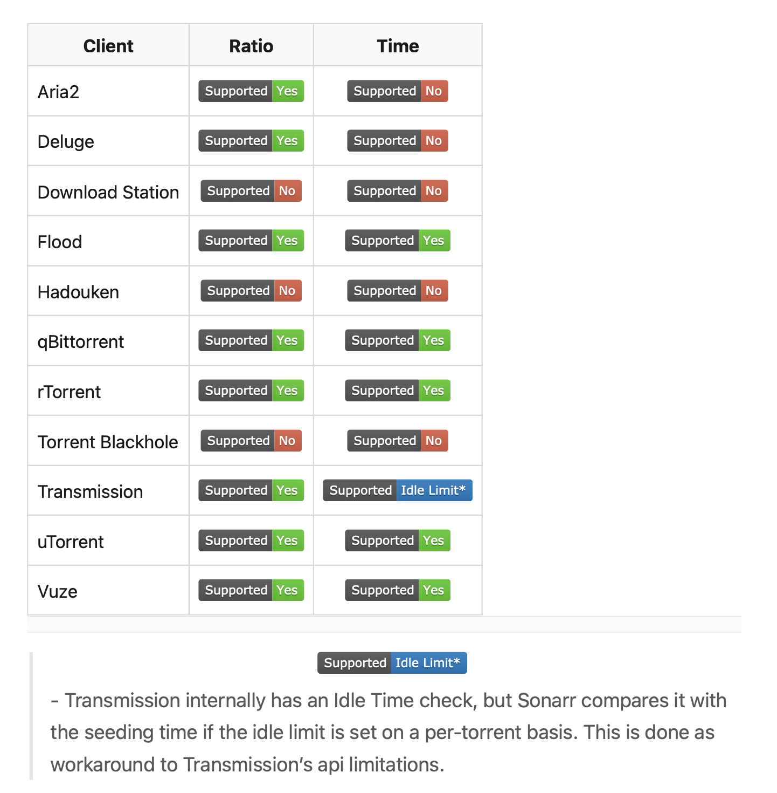

# Why Discovarr?
There are plenty of interesting apps for your media server and after using or trying nearly all of them, I felt like we needed a wiki.

All services are supported on Windows, macOS, Linux, and Docker unless otherwise noted.

# Emoji

You will notice some items on this list have a :star2: next to them. Items with a :star2: represent the author's top pick for that category. This is an entirely opinionated rating from someone who doesn't know everything about every item on the list, so be sure to check out alternative options before assuming something is "the best". That said, I do explore and test every resource I add to this list wherever possible.

# Contact

If you have any idea of changes to make this more readable or to add new apps, don't hesitate to contact me on [olitechfr@gmail.com](mailto:olitechfr@gmail.com)

# *ARR Services & more

## TV Series & Movies

| **Service**                   | **Usage**                            | **Website**                                                     | **Discord/Reddit**                      |
| ----------------------------- | ------------------------------------ | --------------------------------------------------------------- | --------------------------------------- |
| :star2: Sonarr                | Automates & manages **TV series**    | [Sonarr/Sonarr](https://github.com/Sonarr/Sonarr)               | [/r/Sonarr](http://reddit.com/r/sonarr) |
| :star2: Radarr                | Automates & manages **movies**       | [Radarr/Radarr](https://github.com/Radarr/Radarr)               | [/r/Radarr](http://reddit.com/r/Radarr) |
| Bonarr _(yes, seriously!)_ | Automates & manages **adult movies** | [bonarr/Bonarr](https://github.com/bonarr/Bonarr)               |                                         |
| :star2: Bazarr                | Automates & manages **subtitles**    | [morpheus65535/bazarr](https://github.com/morpheus65535/bazarr) |                                         |

### Alternative and miscellaneous

| **Service**        | **Usage**                                                                                                                                            | **Website**                                                                                                           |
| ------------------ | ---------------------------------------------------------------------------------------------------------------------------------------------------- | --------------------------------------------------------------------------------------------------------------------- |
| Sonarr Extended    | Sonarr with additional features                                                                                                                      | [RandomNinjaAtk/docker-sonarr-extended](https://github.com/RandomNinjaAtk/docker-sonarr-extended)                     |
| Radarr Extended    | Radarr with additional features                                                                                                                      | [RandomNinjaAtk/docker-radarr-extended](https://github.com/RandomNinjaAtk/docker-radarr-extended)                     |
| Bobarr             | Radarr+Sonarr+Jackett+VPN                                                                                                                            | [iam4x/bobarr](https://github.com/iam4x/bobarr)                                                                       |
| Quasarr            | Fork of Bobarr, written in PHP.                                                                                                                      | [welcoMatic/quasarr](https://github.com/welcoMattic/quasarr)                                                          |
| Whisparr           | Alternative to Bonarr                                                                                                                                | [Whisparr.com](https://whisparr.com)                                                                                  |[Discord](https://whisparr.com/discord) and [Reddit](https://www.reddit.com/r/whisparr)
| :star2: Excludarr  | Manages you library in Sonarr and Radarr to only consist out of movies and series that are not present on any of the configured streaming providers. | [haijeploeg/excludarr](https://github.com/haijeploeg/excludarr)                                                       |
| Elsewherr          | See disclaimer on page. See if your movies from Radarr are available on a streaming service, and add a tag against the movie if it is.               | [Adman1020/Elsewherr](https://github.com/Adman1020/Elsewherr)                                                         |
| Radarr AutoDelete  | Simple script, which deletes movies with a specific tag after a certain amount of days                                                               | [JCSynthTux/radarr_autodelete](https://github.com/JCSynthTux/radarr_autodelete)                                       |
| Radarr-Striptracks | adds a script to automatically strip out unwanted audio and subtitle streams, keeping only the desired languages.                                    | [linuxserver/docker-mods/tree/radarr-striptracks](https://github.com/linuxserver/docker-mods/tree/radarr-striptracks) |
| TrailerDownloader  | Downloads all missing trailers for movies in your Plex library.                                                                                      | [taylorbobaylor/TrailerDownloader](https://github.com/taylorbobaylor/TrailerDownloader)                               |

### Request system

| **Service**       | **Usage**                                                                                     | **Website**                                       | **Discord/Reddit**                      |
| ----------------- | --------------------------------------------------------------------------------------------- | ------------------------------------------------- | --------------------------------------- |
| :star2: Overseerr | FOSS app for managing requests for your media library. Integrates with your existing services | [sct/overseerr](https://github.com/sct/overseerr) |                                         |
| Ombi              | Manages media requests                                                                        | [tidusjar/Ombi](https://github.com/tidusjar/Ombi) | [/r/Ombi](http://www.reddit.com/r/ombi) |

## Musics

| **Service**    | **Usage**                     | **Website**                                       | **Discord/Reddit**                      |
| -------------- | ----------------------------- | ------------------------------------------------- | --------------------------------------- |
| :star2: Lidarr | Automates & manages **music** | [lidarr/lidarr](https://github.com/lidarr/lidarr) | [/r/lidarr](http://reddit.com/r/lidarr) |

#### Alternative and miscellaneous

| **Service**     | **Usage**                       | **Website**                                                                                       |
| --------------- | ------------------------------- | ------------------------------------------------------------------------------------------------- |
| Lidarr Extended | Lidarr with additional features | [RandomNinjaAtk/docker-lidarr-extended](https://github.com/RandomNinjaAtk/docker-lidarr-extended) |

## Media System

| **Service**               | **Usage**                  | **Website**                          | **Discord/Reddit**                              |
| ------------------------- | -------------------------- | ------------------------------------ | ----------------------------------------------- |
| :star2: Plex Media Server | Self-hosted media platform | [Plex.tv](https://plex.tv)           | [/r/PleX](https://www.reddit.com/r/PleX/)       |
| Jellyfin                  | Free Software Media System | [Jellyfin.org](https://jellyfin.org) | [/r/Jellyfin](http://www.reddit.com/r/jellyfin) |
| Emby                      | Media Server               | [Emby](https://emby.media)           |                                                 |

#### Miscellaneous

| **Service**               | **Usage**                                                                                                              | **Website**                                                         |                                          |
| ------------------------- | ---------------------------------------------------------------------------------------------------------------------- | ------------------------------------------------------------------- | ---------------------------------------- |
| :star2: Plex-Meta-Manager | Automatic collections and metadata                                                                                     | [meisnate12/Plex-Meta-Manager](https://metamanager.wiki/en/latest/) | [Discord](https://discord.gg/NfH6mGFuAB) |
| :star2: Tautulli          | Plex Media Server monitoring                                                                                           | [Tautulli](https://tautulli.com)                                    |                                          |
| Tdarr                     | FFmpeg/HandBrake + video health checking                                                                               | [HaveAGitGat/Tdarr](https://github.com/HaveAGitGat/Tdarr)           | [/r/Tdarr](http://reddit.com/r/tdarr)    |
| Unmanic                   | Transcodes your library                                                                                                | [josh5/unmanic](https://github.com/Josh5/unmanic)                   |                                          |
| Gaps                      | Search through your Plex Server or local folders for all movies, then queries for known movies in the same collection. | [JasonHHouse/gaps](https://github.com/JasonHHouse/gaps)             |                                          |
| Plex-scripts              | Collection of scripts                                                                                                  | [Casvt/Plex-scripts](https://github.com/Casvt/Plex-scripts)         |                                          |

## Ebooks & Comic Books

| **Service**    | **Usage**                           | **Website**                                       | **Discord/Reddit**                       |
| -------------- | ----------------------------------- | ------------------------------------------------- | ---------------------------------------- |
| Readarr        | Automates & manages **ebooks**      | [Readarr.com](https://readarr.com)                | [Discord](https://readarr.com/discord)   |
| :star2: Mylarr | Automates & manages **comic books** | [mylar3/mylar3](https://github.com/mylar3/mylar3) | [Discord](https://discord.gg/6UG94R7E8T) |
| :star2: Komka  | Web comics reader                   | [Komga.org](https://komga.org)                    | [Discord](https://discord.gg/TdRpkDu)    |

#### Alternative and miscellaneous

| **Service**      | **Usage**                        | **Website**                                                                                         |                                                             |
| ---------------- | -------------------------------- | --------------------------------------------------------------------------------------------------- | ----------------------------------------------------------- |
| Readarr Extended | Readarr with additional features | [RandomNinjaAtk/docker-readarr-extended](https://github.com/RandomNinjaAtk/docker-readarr-extended) |                                                             |
| LazyLibrarian    | Alternative to Readarr           | [Website](https://lazylibrarian.gitlab.io)                                                          | [/r/LazyLibrarian](https://www.reddit.com/r/LazyLibrarian/) |

### Admin Panel

| **Service**      | **Usage**                                                      | **Website**                                                     | **Discord/Reddit**                            |
| ---------------- | -------------------------------------------------------------- | --------------------------------------------------------------- | --------------------------------------------- |
| :star2: Heimdall | A dashboard to organize and view the status of all your apps.  | [linuxserver/Heimdall](https://github.com/linuxserver/Heimdall) | [Discord](https://discord.com/invite/CCjHKn4) |
| Organizr         | HTPC/Homelab Services Organizer                                | [/causefx/Organizr](https://github.com/causefx/Organizr)        | [/r/Organizr](http://reddit.com/r/organizr)   |
| Monitorr         | A webfront to live display the status of any webapp or service | [Monitorr/Monitorr](https://github.com/Monitorr/Monitorr)       |                                               |

## Tracker Proxies

| **Service**      | **Usage**                                       | **Website**                                                   | **Discord/Reddit**                          |
| ---------------- | ----------------------------------------------- | ------------------------------------------------------------- | ------------------------------------------- |
| :star2: Prowlarr | Indexer Manager that syncs with other *arrs.    | [Prowlarr/Prowlarr](https://github.com/Prowlarr/Prowlarr)     | [/r/Prowlarr](http://reddit.com/r/prowlarr) |
| Jackett          | API Support for your favorite torrent trackers. | [Jackett/Jackett](https://github.com/Jackett/Jackett)         | [/r/Jackett](http://reddit.com/r/jackett)   |
| Cardigann        | Alternative to Jackett                          | [cardigann/cardigann](https://github.com/cardigann/cardigann) |                                             |

#### Torrent client

Here is the compatibility of most of torrent clients with *ARR Apps :

Recommandations are :
- Transmission : A lightweight torrent downloading client.
- qBittorrent : Reliable, lightweight linux torrent client

## Bot

| **Service**      | **Usage**                                                                                                       | **Website**                                                                       | **Discord/Reddit** |
| ---------------- | --------------------------------------------------------------------------------------------------------------- | --------------------------------------------------------------------------------- | ------------------ |
| Addarr           | Telegram bot for Sonarr/Radarr                                                                                  | [Waterboy1602/Addarr](https://github.com/Waterboy1602/Addarr)                     |                    |
| Comandarr        | Bot that interacts with *arr apps with integrations                                                             | [Commandarr/Commandarr](https://github.com/Commandarr/Commandarr)                 |                    |
| Doplarr          | Uses modern Discord slash commands and components, which provides a clean, performant UI on desktop and mobile. | [kiranshila/Doplarr](https://github.com/kiranshila/Doplarr)                       |                    |
| Searcharr        | Sonarr & Radarr Telegram Bot                                                                                    | [toddrobb99/searcharr](https://github.com/toddrob99/searcharr)                    |                    |
| Jackett2Telegram | A self-hosted Telegram Python Bot that dumps posts from Jackett RSS feeds to a Telegram chat.                   | [danimart1991/jackett2telegram](https://github.com/danimart1991/jackett2telegram) |                    |
| Invitarr         | Chatbot that invites discord users to plex                                                                      | [Website](https://github.com/Sleepingpirates/Invitarr)                            |                    |
| Requestrr        | chatbot used to simplify using services like Sonarr/Radarr/Ombi via chat                                        | [Darkalfx/requestrr](https://github.com/darkalfx/requestrr)                       |                    |

## Miscellaneous

| **Service**             | **Usage**                                                                                                                                                                            | **Website**                                                                               | **Discord/Reddit** |
| ----------------------- | ------------------------------------------------------------------------------------------------------------------------------------------------------------------------------------ | ----------------------------------------------------------------------------------------- | ------------------ |
| LunaSea                 | Self-Hosted Controller for your phone                                                                                                                                                | [LunaSea.app](https://www.lunasea.app)                                                    |                    |
| Exportarr               | AIO Prometheus Exporter for Sonarr, Radarr or Lidarr                                                                                                                                 | [onedr0op/exportarr](https://github.com/onedr0p/exportarr)                                |                    |
| Listrr                  | Automates lists on trakt.tv based on your filters.                                                                                                                                   | [TheUltimateC0der/Listrr](https://github.com/TheUltimateC0der/Listrr)                     |                    |
| MDBList                 | Listrr.pro alternative with scrapped movie ratings from imdb, tmdb, trakt, letterboxd, rottentomatoes and metacritics.                                                               | [MDBList.com](https://mdblist.com)                                                        |                    |
| Logarr                  | A log consolidation tool written in PHP                                                                                                                                              | [Monitorr/logarr](https://github.com/Monitorr/logarr)                                     |                    |
| Movearr                 | Simple CLI tool to perform Sonnar/Radarr moves based on specific criteria.                                                                                                           | [l3uddz/movearr](https://github.com/l3uddz/movearr)                                       |                    |
| Posterr                 | Media display for Plex, Sonarr, and Radarr                                                                                                                                           | [petersem/posterr](https://github.com/petersem/poster)                                    |                    |
| Syncarr                 | Sync two Radarr/Sonarr/Lidarr servers via API                                                                                                                                        | [syncarr/syncarr](https://github.com/syncarr/syncarr)                                     |                    |
| Recyclarr               | Automatically sync TRaSH guides to your Sonarr and Radarr instances                                                                                                                  | [Recyclarr.dev](https://recyclarr.dev/wiki/)                                              |                    |
| Traktarr                | Add new media based on Trakt lists                                                                                                                                                   | [l3uddz/traktarr](https://github.com/l3uddz/traktarr)                                     |                    |
| Unpackerr               | Extracts archives from watch folders for import into other ARR apps                                                                                                                  | [davidnewhall/unpackerr](https://github.com/davidnewhall/unpackerr)                       |                    |
| Gaps                    | Searches through your Plex Server for all movies, then queries for known movies in the same collection.                                                                              | [JasonHHouse](https://github.com/JasonHHouse/gaps)                                        |                    |
| Sickbeard MP4 Automator | Automatically converts media files downloaded by various programs to a standardized format, and tags them with the appropriate metadata from TMDB if the container supports tagging. | [mdhiggins/sickbeard_mp4_automator](https://github.com/mdhiggins/sickbeard_mp4_automator) |                    |
| theme.park              | Themes for all the *arrs                                                                                                                                                             | [gilbn/theme.park](https://github.com/gilbN/theme.park)                                   |                    |
| Pulsarr                 | Browser extension for adding movies to Radarr or Series' to Sonarr while browsing IMDB or TVDB.                                                                                      | [Website](https://github.com/roboticsound/Pulsarr)                                        |                    |
| Wantarr                 | CLI tool for Radarr/Sonarr                                                                                                                                                           | [l3uddz/wantarr](https://github.com/l3uddz/wantarr)                                       |                    |
| Flemarr                 | Python script that parses a configuration written in YAML and can apply it to any of the -arr apps using their API.                                                                  | [Flemarr/Flemarr](https://github.com/Flemmarr/Flemmarr)                                   |                    |
| Buildarr                | Solution to automating deployment and configuration of your *Arr stack                                                                                                               | [buildarr/buildarr](https://github.com/buildarr/buildarr)                                 |                    |